<h1 align="center">Bagaskara Amukti Palapa</h1>

  <b>Full-Stack Web Developer &nbsp;·&nbsp; AI / Machine Learning Practitioner &nbsp;·&nbsp; Blue Team Security</b> 
  Informatics Engineering — Universitas Bina Darma, Palembang, Indonesia

  
  

  
  
  

---

### Executive Summary

A versatile Informatics Engineering undergraduate bridging modern full-stack web engineering, applied artificial intelligence, and defensive system security. Experienced in engineering high-performance web applications using modern JavaScript/TypeScript, PHP & Laravel, and relational database architectures. Currently deepening expertise in **machine learning, deep learning, and Large Language Model (LLM) engineering**, from classical model training to retrieval-augmented and agentic AI workflows. On the security side, focused on **Blue Team defensive engineering** — log analysis, threat detection, and hardening — supported by hands-on web vulnerability assessment and active participation in Capture The Flag (CTF) competitions.

---

  

---

## Core Expertise

<table>
  <tr>
    <td align="center" width="33%">
      <b>Artificial Intelligence</b> 
      Machine Learning · Deep Learning LLM &amp; Agentic Systems
    </td>
    <td align="center" width="33%">
      <b>Cyber Security</b> 
      Blue Team Defense · SOC Analysis Web Penetration Testing
    </td>
    <td align="center" width="33%">
      <b>Web Development</b> 
      Full-Stack Engineering Performance &amp; Secure Coding
    </td>
  </tr>
</table>

---

## 1. Artificial Intelligence, Machine Learning & LLM Engineering

**Languages & Scientific Computing**

**Machine Learning & Deep Learning**

**LLM, RAG & Agentic Developer Tools**

---

## 2. Cyber Security — Blue Team & Defensive Engineering

**Primary Focus: Blue Team**

**Tooling & Analysis**

**Secure Development**

---

## 3. Web Development & Full-Stack Engineering

**Front-End**

**Back-End**

**Databases & Cloud**

---

### Operating Systems, DevOps & Containers

---

### Selected Projects

- **[Kostan BagaskaraAP-Dev](https://github.com/BagaskaraAP-Dev/kostan-bagaskaraap-dev)**
  - *Full-Stack Property Management & Booking System with Automated CI/CD*
  - Built with Node.js, Express REST API, SQLite relational database, responsive design, and local SVG architectural illustrations.
  - Features real-time occupancy statistics, dynamic booking cost calculations, tenant verification, and a multi-status helpdesk issue ticketing system.
  - Deployed on GitHub Pages with automated GitHub Actions CI integrity verification.
  - [Live Demo](https://bagaskaraap-dev.github.io/kostan-bagaskaraap-dev/) | [Repository](https://github.com/BagaskaraAP-Dev/kostan-bagaskaraap-dev)

- **[Mooncrust AI](https://github.com/BagaskaraAP-Dev/MOONCRUST-AI-BELUM-FINAL)**
  - *Conversational AI Assistant & LLM Interface*
  - Lightweight, high-performance web interface utilizing Vanilla JavaScript to manage complex chat state, dynamic DOM updates, and asynchronous LLM API calls.
  - Engineered with robust error handling and fallback capabilities for continuous availability.
  - [Repository](https://github.com/BagaskaraAP-Dev/MOONCRUST-AI-BELUM-FINAL)

- **Program Kasir (Real-Time POS Web App)**
  - *Client-Side Architecture & Real-Time Cloud Database*
  - Point of Sale interface powered by Google Cloud Firestore.
  - Implemented client-side state handling, dynamic product filtering, cart calculations, and real-time synchronization without full page reloads.

- **Anneta Fotocopy (High-Performance Business Platform)**
  - *Semantic Architecture & Web Performance Optimization*
  - Designed and delivered a fully responsive business landing page strictly using semantic HTML5 and optimized CSS.
  - Achieved top-tier Google Lighthouse scores for performance, accessibility, and SEO metrics.

---

### Experience & Roles

- **Freelance Full-Stack & Front-End Developer**  
  *Self-employed | Palembang, Indonesia (2024 - Present)*
  - Architecting and delivering responsive, accessible web applications from scratch using modern JavaScript, PHP, and modern CSS.
  - Integrating cloud databases (Firebase/Firestore) and relational databases (MySQL, SQLite) for real-time data handling.
  - Implementing conversational interfaces and AI-driven workflows directly in browser environments.

- **Cyber Security Competitor & Blue Team Practitioner**  
  *Team Martabak Manis (2025 - Present)*
  - Actively competing in national and regional Capture The Flag (CTF) events.
  - Applying Blue Team defensive methodologies: traffic and log analysis, threat detection, and infrastructure hardening.
  - Analyzing web application vulnerabilities and testing threat vectors to strengthen defensive posture.
  - Awarded 2nd Place at the South Sumatra Provincial LKS Cyber Security Competition (2025).

---

### Education

- **Universitas Bina Darma**  
  *Bachelor of Informatics Engineering (S1 Teknik Informatika)*  
  2026 - Present

- **SMK Muhammadiyah 03 Sukaraja**  
  *Computer and Network Engineering (Teknik Komputer dan Jaringan / TKJ)*  
  2022 - 2025

---

### Honors & Certifications

- **2nd Place Winner**, LKS Cyber Security South Sumatra Provincial Competition (2025)
- **White-hat Hacker Essentials**, Certificate of Completion
- **Blue Team Fundamentals**, Certificate of Completion
- **Fundamental Front-End Web Development**, Certificate of Completion

---

### GitHub Analytics

  
  

---

### Contact & Connect

  
  
  

<i>keep learning</i>

